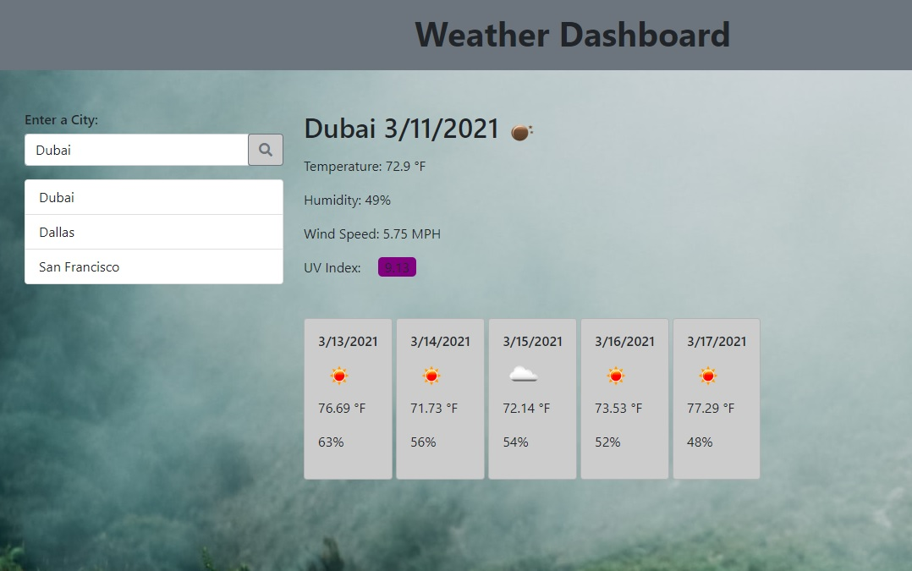

Weather Dashboard
====
What if you wanted to know the weather on the fly? Plug in the city you want to know the weather for into the Weather Dashboard and you'll be kept up to date on the current and upcoming weather for anywhere in the world!

----

## Current Weather
Simply type into the searchbar the city you for which you wnt to see the weather and you will be given the current weather and the five day forecast for that city!



----

## How does it get the weather???
```function getCurrent() {
  var queryURL =
    "http://api.openweathermap.org/data/2.5/weather?q=" +
    cityName +
    "&units=imperial&appid=40e2dec5462a7caaff123f43a6aa58d6";

  $.ajax({
    url: queryURL,
    method: "GET",
  }).then(function (data) {
    console.log(data);
    // setting the variable to convert unix timestamp to a different date format unique to the luxon api
    var time = DateTime.fromSeconds(data.dt).toLocaleString(
      DateTime.DATE_SHORT
    );

    $("h2").text(data.name + " " + time);
    $("#currentIcon").attr(
      "src",
      "http://openweathermap.org/img/w/" + data.weather[0].icon + ".png"
    );
    $("#tempNow").text("Temperature: " + data.main.temp + " °F");
    $("#hum").text("Humidity: " + data.main.humidity + "%");
    $("#wind").text("Wind Speed: " + data.wind.speed + " MPH");

    // calling this function with these specific arguments pulls the lat and lon data from the queried city
    // allows us to obtain lat and lon and pass it on to other functions where they are required in the api url
    getfiveDay(data.coord.lat, data.coord.lon);
    getUV(data.coord.lat, data.coord.lon);
    uvColor();
  });
} 
```
This AJAX request queries the openweathermap API for the city in question and dynamically creates elements that are populated with values from the response object.

We can also create repeating elements with the same respone object using template literals.

```
var html = `
          <div class="card">
          <div class="card-body">
              <h6 class="card-title">${date5}</h6>
              
              <p>${data.daily[i].temp.day + " °F"}</p>
              <p>${data.daily[i].humidity + "%"}</p>
          </div>
          </div>
      `;
      $("#fiveDayFore").append(html);
     
 ```

Using a for loop, this document will be populated for each object in our array of responses from the weather API and also dynamically appear on the webpage when a city is searched.

----

## 

----

## Built Using
* [OpenWeather API](https://openweathermap.org/)
* [Luxon](https://moment.github.io/luxon/)
* Jquery
* Javascript
* HTML
* CSS
* Git
* GitHub

----

## Deployed Link
[Weather Dashboard](https://spenrad.github.io/Weather-Dashboard/)

----

## Author
Spencer Christy<br>
[GitHub](https://github.com/spenrad)<br>
[LinkedIn](https://www.linkedin.com/in/spencer-christy-543b84b3/)<br>

----

## Acknowledgements
Thank you for reading, stay dry out there!

